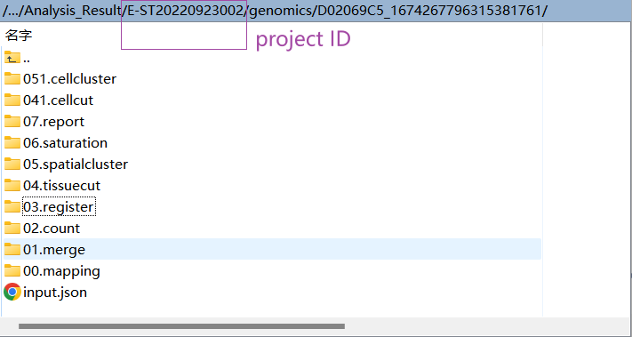
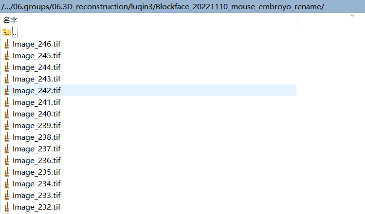

## sheet file
__Note:__ Record table naming needs to follow the specification, like ```{project_name}_slice_records_{date}.xlsx```, eg
```E-ST20220923002_slice_records_20221110.xlsx```.
The file has two tables. Among them, Table ```Meta``` records the key original data, which will be used in the process of generating the mesh file; Table ```SliceSequence``` describes how any section of the three-dimensional tissue is utilized throughout the sectioning process. This information is critical to the entire process.

### Meta
|  Name   | Description  |
|  ----  | ----  |
| SampleName  | Tags for documenting organization |
| Magnification  | Optical imaging magnification |
| SizePerPixel  | The physical size of each pixel |
| CameraTravelDistance  | The movement distance of the camera in the X direction |
| Z-interval  | The stepping distance of the robotic arm on the Z axis |

### SliceSequence
|  Name   | Description  | Value  |
|  ----  | ----  | ----  |
| Slice_ID  | Tags for documenting organization | - |
| Z_index  | Optical imaging magnification | - |
| Idling  | The physical size of each pixel | - |
| SSDNA_SN  | The movement distance of the camera in the X direction |  -|
| SSDNA_ChipNo  | The stepping distance of the robotic arm on the Z axis | - |
| BlockFaceNo  | The stepping distance of the robotic arm on the Z axis | - |
| BF_del  | The stepping distance of the robotic arm on the Z axis | - |
| HE_SN  | The stepping distance of the robotic arm on the Z axis | - |

## SAW output
<h3 align="left">
  <br/>
</h3>
<h4 align="left">Fig Output of SAW</h4><br>

Currently, the SAW output we use only includes clustered h5ad files, eg: ```genomics/{chip_no}_{serial number}/05.spatialcluster```. In the future, we may use the data under path ```03.register```, and this subsequent use will be updated.

## Block Face
<h3 align="left">
  <br/>
</h3>
<h4 align="left">Fig Image List of BlockFace</h4><br>
The output directory structure of BlockFace is shown in the figure above. At present, the embedding blocks are heavily translucent, resulting in too blurred tissue boundaries in block face images, and it is almost difficult to define the boundary positions subjectively. We are improving and improving the experimental process to obtain higher quality image data, so as to improve the reliability and success rate of the process. Note: New data may promote process logic updates and algorithm updates.

## output


